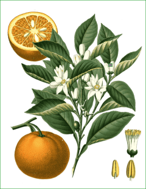

 

# smartPflanze


A Group of little IoT projects to make various devices for monitoring the environment and soil conditions of my *Citrus myrtifolia* tree.


## Repository Layout
```
├── misc
└── soilMonitor
    ├── constants.h
    ├── example-secrets.h
    └── soilMonitor.ino
```

## MCU and Sensors

- [D1 mini](https://www.wemos.cc/en/latest/d1/d1_mini.html)
- [Capacitive Soil Sensor](https://www.elecrow.com/crowtail-capacitive-soil-moisture-sensor.html)
- [BMP280](https://www.adafruit.com/product/2651)

# Projects

## Soil Monitoring
Directory: `soilMonitor/`

*Citrus myrtifolia*, like most orange tree species, is very sensitive to over-watering causing fungal root rot. It is advised to only water this species when the soil is almost bone dry. Unfortunately, this requires a bit of experience to judge correctly and thus this project aims to create a monitoring system for the moisture content in the soil as well as the general environmental conditions of the tree.